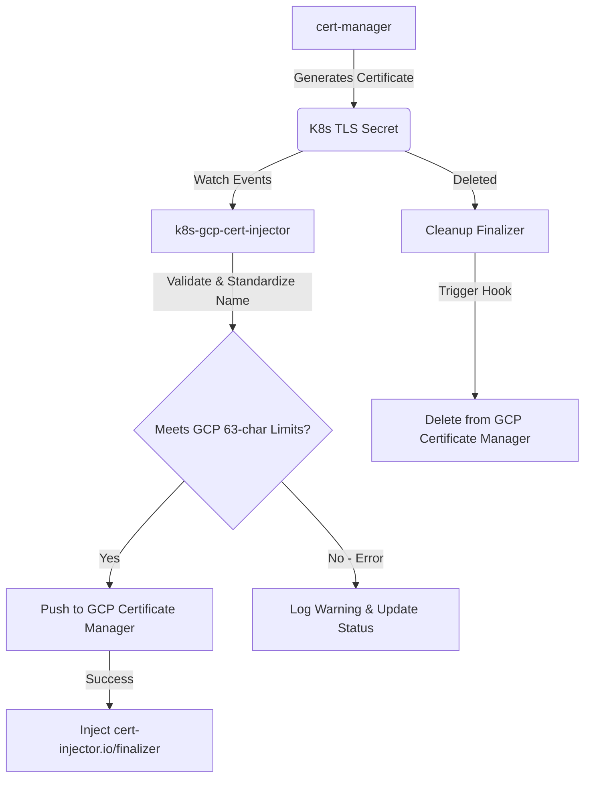

# k8s-gcp-cert-injector

A production-grade, highly extensible Kubernetes operator that watches TLS Secrets (`kubernetes.io/tls`) and automatically replicates them to GCP Certificate Manager as `SELF_MANAGED` certificates. 

This controller implements a "push-based" model to bridge asynchronous TLS generation (e.g., via `cert-manager`) to GCP HTTPS Load Balancers, avoiding the need for Terraform or other orchestration tools to block on asynchronous certificate provisioning.

---

## Architecture Overview



---

## GCP IAM Permissions & Security

To safely push certificates to GCP, the operator requires permissions on the **GCP Certificate Manager** API. It is highly recommended to authenticate using **GKE Workload Identity Federation** rather than long-lived static service account keys.

### 1. Predefined IAM Role
To manage certificates, grant the GCP Service Account (GSA) the following predefined role:
* **`roles/certificatemanager.editor`** (Certificate Manager Editor)

### 2. Fine-Grained Custom IAM Role
If your organization requires the principle of least privilege, you can define a custom IAM role with the following granular permissions:
* `certificatemanager.certificates.create`
* `certificatemanager.certificates.get`
* `certificatemanager.certificates.delete`
* `certificatemanager.certificates.update`
* `certificatemanager.certificates.list`

---

## GKE Workload Identity Setup

Follow these steps to configure **Workload Identity** on GKE to securely authorize the operator:

### Step 1: Define Environment Variables
```bash
export PROJECT_ID="your-gcp-project-id"
export GSA_NAME="k8s-gcp-cert-injector"
export KSA_NAME="k8s-gcp-cert-injector-controller-manager"
export NAMESPACE="cert-injector-system"
```

### Step 2: Create the GCP Service Account (GSA)
```bash
gcloud iam service-accounts create ${GSA_NAME} \
    --project=${PROJECT_ID} \
    --description="Service account for k8s-gcp-cert-injector operator" \
    --display-name="k8s-gcp-cert-injector"
```

### Step 3: Grant IAM Permissions to the GSA
```bash
gcloud projects add-iam-policy-binding ${PROJECT_ID} \
    --member="serviceAccount:${GSA_NAME}@${PROJECT_ID}.iam.gserviceaccount.com" \
    --role="roles/certificatemanager.editor"
```

### Step 4: Authorize Kubernetes Service Account (KSA) Impersonation
Allow the GKE-specific ServiceAccount to act as the GSA:
```bash
gcloud iam service-accounts add-iam-policy-binding \
    ${GSA_NAME}@${PROJECT_ID}.iam.gserviceaccount.com \
    --project=${PROJECT_ID} \
    --role="roles/iam.workloadIdentityUser" \
    --member="serviceAccount:${PROJECT_ID}.svc.id.goog[${NAMESPACE}/${KSA_NAME}]"
```

---

## Helm Installation

The operator is distributed as a Helm chart located under the [charts/chart/](file:///Users/matgou/workspace/k8s-gcp-cert-injector/charts/chart) directory.

### 1. Basic Installation with Workload Identity
Prepare your `values.yaml` overrides or set values via `--set`:

```yaml
# my-values.yaml
serviceAccount:
  annotations:
    iam.gke.io/gcp-service-account: "k8s-gcp-cert-injector@your-gcp-project-id.iam.gserviceaccount.com"

manager:
  args:
    - --leader-elect
    - --gcp-project-id=your-gcp-project-id  # Optional, falls back to metadata server
```

Install the chart:
```bash
helm install k8s-gcp-cert-injector ./charts/chart \
  --namespace cert-injector-system \
  --create-namespace \
  -f my-values.yaml
```

---

## How to Sync Secrets

To sync a Kubernetes `kubernetes.io/tls` secret to GCP Certificate Manager, configure the secret with the annotations described below.

### 1. cert-manager Certificate Integration Example (Recommended)
If you are using **cert-manager** to automatically provision and rotate TLS certificates, use the `secretTemplate` field to automatically inject the required sync annotations onto the generated Kubernetes Secret:

```yaml
apiVersion: cert-manager.io/v1
kind: Certificate
metadata:
  name: wildcard-example-com
  namespace: prod
spec:
  secretName: wild-example-com-tls
  dnsNames:
    - "*.example.com"
    - "example.com"
  issuerRef:
    name: letsencrypt-prod
    kind: ClusterIssuer
  secretTemplate:
    annotations:
      # Enable replication to GCP Certificate Manager
      cert-injector.io/sync: "true"
      
      # Optional: Override the certificate resource name in GCP
      cert-injector.io/cert-name: "wildcard-example-com"
      
      # Optional: Route this certificate to a remote/different GCP Project
      cert-injector.io/gcp-project: "remote-gcp-project-id"
      
      # Optional: Partition this certificate inside a specific universe domain / environment
      # This suffixes the certificate name in GCP with "-emea-prod"
      cert-injector.io/universe-domain: "emea-prod"
```

### 2. Standard Secret Example (Manual Creation)
```yaml
apiVersion: v1
kind: Secret
metadata:
  name: wild-example-com-tls
  namespace: prod
  annotations:
    # 1. Enable replication to GCP Certificate Manager
    cert-injector.io/sync: "true"
    
    # 2. Optional: override the resulting certificate name in GCP
    # If not set, defaults to: k8s-cert-prod-wild-example-com-tls
    cert-injector.io/cert-name: "wildcard-example-com"
    
    # 3. Optional: replicate to a completely separate GCP project
    cert-injector.io/gcp-project: "remote-gcp-project-id"
    
    # 4. Optional: scope by universe domain (appends "-emea-prod" to the cert name)
    cert-injector.io/universe-domain: "emea-prod"
type: kubernetes.io/tls
data:
  tls.crt: <base64-encoded-certificate-chain>
  tls.key: <base64-encoded-private-key>
```

### Supported Annotations

| Annotation | Type | Description |
|---|---|---|
| `cert-injector.io/sync` | `string` ("true") | Triggers replication to GCP Certificate Manager. |
| `cert-injector.io/cert-name` | `string` | Custom name override for the GCP Certificate. Must be DNS-1123 compliant and $\le$ 63 chars. |
| `cert-injector.io/gcp-project` | `string` | Optional. Replicates this certificate to a completely different / remote GCP Project ID. |
| `cert-injector.io/universe-domain` | `string` | Optional. Scopes the certificate by a remote universe domain/suffix (aligns with GCP Universe Domain conventions). Suffixes the resulting GCP certificate name with `-{universe-domain}` (e.g. `-emea-prod`). |

### GCP Naming Safety & Length Limits
GCP Certificate Manager enforces a **strict 63-character limit** and a DNS-1123 lowercase alphanumeric format (`^[a-z0-9-]{1,63}$`) on certificate resource names.
* **Fallback Format**: `k8s-cert-{namespace}-{secret-name}`
* **Pre-validation**: If the fallback or custom override name exceeds 63 characters, or contains invalid characters, the controller logs an early, clear warning and does *not* send the request to GCP, preventing API-level reject loops.

---

## Local Development & Testing

This project uses a reproducible Nix developer environment managed via `devenv`.

### 1. Prerequisites
Ensure you have `devenv` installed on your machine.

### 2. Enter Shell
All Go commands should be run within the `devenv` shell to ensure consistent dependencies (Go 1.26.2, Kubebuilder CLI, controller-gen, etc.):
```bash
devenv shell
```

### 3. Run the Test Suite
The integration test suite utilizes `envtest` to run against a real local Kubernetes Control Plane:
```bash
# Prefix with GOWORK=off to ignore outer Go workspaces during sandbox testing
GOWORK=off devenv shell make test
```

### 4. Code Formatting and Linting
Format the codebase before pushing changes:
```bash
GOWORK=off devenv shell make fmt
GOWORK=off devenv shell make vet
```

---

## License

Copyright 2026. Licensed under the Apache License, Version 2.0.
